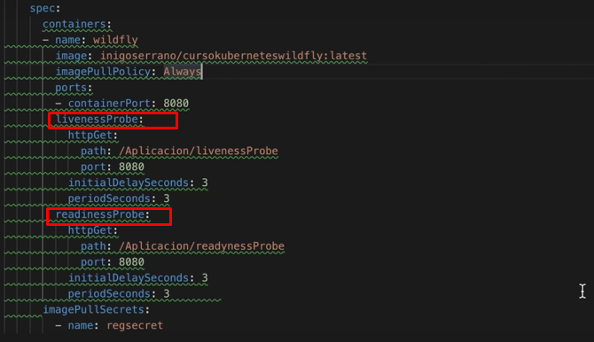
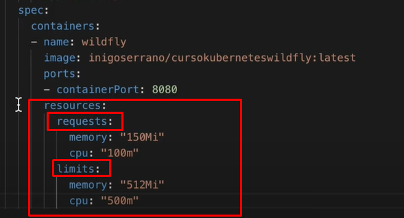

# APUNTES K8S

## Instalcion de kubectl


* windows (usando el gestor de paquetes chocolatey) : 
* * choco install kubernetes-cli
* linux:
* * ubunti/debian : 
* * * sudo apt-get update && sudo apt-get install -y kubectl
* * CentOS/RHEL:
* * * sudo yum install -y kubectl
* * Fedora
* * * sudo dnf install -y kubectl
* * Arch Linux
* * * sudo pacman -S kubectl


## Revisar version kubectl
* kubectl version --client

## Instalacion de minikube

* windows:
* * choco install minikube
* lunix:
* * descarga el binario:
* * * curl -LO https://storage.googleapis.com/minikube/releases/latest/minikube-linux-amd64 sudo install minikube-linux-amd64 /usr/local/bin/minikube
* * descomprimes el archivo y mueves el binario a un directorio de tu PATH o incluyes la ruta del binario en tu PATH.

## Revisar version minikube:
* minikube version


## Configuracion de memoria del minikube
* Si esta corriendo detienes el minikube.
*  * minikube stop
* defines la cantidad de memoria que deseas en MB (ejemplo para 4 GB)
*  * minikube config set memory= 4096

* levantar el minikube
*  * minikube start

## Perfiles

### Sirve para simular varios cluster, pero no pueden correr en simultaneo.

### creacion de perfiles:

* minikube profile nombre_del_perfil
* * "puedes tener configuraciones diferentes en cada uno de los perfiles, pero para manejar los perfiles tienes que detener uno para levantar el otro"

### Eliminar perfiles
* minikube stop
* minikube delete -p nombre_del_perfil


## Namespaces
### Se conocen como clusters virtuales, es una forma de separar diferentes ambientes o entornos, tambien separar cosas de diferentes clientes.
### Ver namespaces creados
* kubectl get namespaces
### Creacion de namespaces

* ### linea de comandos

* * kubectl create namespace nombre_namespace

* ### Usando ficheros Yml
``` yaml
apiVersion: v1
kind: Namespace
metadata:
  name: nombre-amespace
````
* El archivo .yml que tiene la informacion para crear el namespace se llama namespace.yml
* Ahora creamos el namespace a partir del archivo yendonos a la carpeta donode esta el archivo y ejecutando:
* * kubectl apply -f namespace.yml

### Cabiar de Namespace

* Ejecutar : "kubens nombre-del-namespace"

### Emilinar namespace 

* ### linea de comandos

* * kubectl delete namespace nombre_namespace

* ### Usando ficheros Yml

* * kubectl delete -f namespace.yml

## Que es un POD

* De manera simplificada un pod, es la unidad minima de trabajo. Podria ser equivalente a referirse a un contenedor. Marcando un poco mas la diferencia un pod tambien podria ser mas de un contenedor. Así que de manea general un POD se define como una unidad que a su vez esta compuesta por  1 o mas contenedores.

### ¿Como crear un POD?

* #### con fichero yml:
```yaml
apiVersion: v1
kind: Pod
metadata:
  name: pod-example-1
spec:
  containers:
  - name: pod-example-1
    image: imagen-para-levantar-el contenedor
```
* luego solo ejecutas "kubectl apply -f fichero-pod.yml"

### Ver PODS

* ejecutar "kubectl get pods"


### Obtener informacion de un pod

* ejecutar "kubectl describe pod nombre-del-pod"

### Acceder a un pod 

* ejecutar "kubectl exect -it nombre-del-pod bash"
* ejecutar "kubectl exect -it nombre-del-pod sh"

### Ver los logs de un POD

* ejecutar "kubectl logs -f nombre-del-pod"
    
## DEPLOYMENTS

### ¿Que es un deployment? :
* Es una forma declarativa de crear los pods necesarios y los replicaset(la cantidad de pods que se desean), en los deployment definimos el estado que deseamos y en controlador de deployment se encarga de verificar, gestionar y mantener ese estado deseado.

* Conceptos claves:

*  * ReplicaSet
*  * Controlador deployment.
*  * Estado de deployment deseado.


### Creando deployment

```yaml
apiVersion: apps/v1
kind: Deployment
metadata:
  name: deployment-name
spec:
  selector:
    matchLabels:
      app: asset-ms
  replicas: 2
  template:
    metadata:
      labels:
        app: asset-ms
    spec:
      containers:
        - name: asset-ms
          image: nombre-de-la-imagen-a-utilizar:version-de-la-imagen
          ports:
            - containerPort: 8080
```

* Ejecutar "kubectl apply -f deployment.yml"

### Ver deployments creados

* Ejecutar "kubectl get deployments"


### Eliminar un deployment

* Ejecutar "kubectl delete -f deployment.yml"


## SERVICIO

### ¿ Que es un servicio ? :
* Dado que los pods que creamos ya sea usando un archivo pod.yml o deployment.yml son desechables por definicion, entonces no podemos enlazar nuestras peticiones directamente a un pod, sino que en estos casos se crea un servicio que actua como proxy y su funcion es, dependiendo del tipo de servicio, exponer un punto de entrada de las peticiones y dirigirlas hacia las instanacias o pods que hay detras. de tal forma que si tenemos 1 o 1000 pods de un mismo servicio o por otro lado esos pods estan siento "matados" y "levantados" constantemente por los controladores de deloyment para mantener el estado del deployment que definimos o las reglas de escalado, En cualquier caso siempre se mantendrá un mismo punto de entrada de las peticiones, que en este caso seria el servicio. Manteniendo asi todo el laborioso trabajo de "Disponibilidad", "Resiliencia" y "Escalabilidad" que sucede por detras, totalmente transparente a quien consume el servicio.

### Ver servicios

* Ejecutar: "kubectl get service"

### Cuantos tipos de servicios hay ? :
* Hay dos grupos de servicios en kubernetes.
* * INTERNOS
* * EXTERNOS

#### SERVICIOS INTERNOS

* Cluster IP : Utilizado comunmente para la comunicacion entre ms o pods dentro del cluster.
Ejemplo: Cuando deseas conectar una BBDD con un servicio.

#### SERVICIOS EXTERNOS

* NodePort : Asigna una ip publica y puedes acceder a los pods que estan detras con esta ip y el puerto en el que estan expuestos los pods.

* LoadBalancer : Asigna una ip publica y se realiza el balanceo de carga hacia los pods que estan detras de este servicio.


## CREAR SERVICIO:

* INTERNO :

```yaml
apiVersion: v1
kind: Service
metadata:
  name: my-internal-service
spec:
  selector:
    app: my-app
  ports:
    - protocol: TCP
      port: 80
      targetPort: 8080

```
* Ejecutar "kubectl apply -f service.yml"

* EXTERNO
* * NodePort :

```yaml
apiVersion: v1
kind: Service
metadata:
  name: my-external-service
spec:
  selector:
    app: my-app
  ports:
    - protocol: TCP
      port: 30001  # Puerto asignado en cada nodo
      targetPort: 8080
  type: NodePort

```

* Ejecutar "kubectl apply -f service.yml"

* * LoadBalancer : 
```yaml
apiVersion: v1
kind: Service
metadata:
  name: my-external-service
spec:
  selector:
    app: my-app
  ports:
    - protocol: TCP
      port: 80
      targetPort: 8080
  type: LoadBalancer
 
```
* Ejecutar "kubectl apply -f service.yml"


## CASOS DE USO DE LOS SERVICE:

### Servicio Interno:

Comunicación entre microservicios dentro del clúster.
* Bases de datos internas.
* Otros servicios que no necesitan ser accesibles desde fuera del clúster.

### Servicio Externo:

* Exponer una aplicación web al público.
* Exponer una API para consumidores externos.
* Integración con servicios externos.
* Balanceo de carga y distribución de tráfico externo.


# VARIABLES DE ENTORNO

* Se agregan en cada contenedor dependiendo de la necesidad de cada uno de estos, son datos que estan en el contexto del contenedor cuando se crea y son necesarias para su funcionamiento. Dependiendo de la imagen utilizada en la documentacion de dicha imagen en dockerhub dice las variables de entornos necesarias para el funcionamiento de dicho contenedor.


# INGRESS

Sirve para exponer los servicios creados dentro del cluster de k8s.

### CREAR INGRESS
* Instalar complemento.

* * Ejecutar "minikube addons enable ingress"

* Verifiar si esta corriendo en controlador

* * Ejecutar "kubectl get pods -n ingress-nginx"

* * ingress.yml: 
```yaml
apiVersion: networking.k8s.io/v1
kind: Ingress
metadata:
  name: service-ingress
  annotations:
    nginx.ingress.kubernetes.io/rewrite-target: /$1
spec:
  rules:
    - host: localhost
      http:
        paths:
          - path: /
            pathType: Prefix
            backend:
              service:
                name: service-assignee-ms
                port:
                  number: 8080 
```

* * Ejecutar "Kubectl apply -f ingres.yml"

* * testear en "localhost/"


# FIN DE SECCION BASICA KUBERNETES


### en windows 
* * Si deseas que kb apunte al docker daemon puedes ejecutar este comando:
"@FOR /f "tokens=*" %i IN ('minikube -p minikube docker-env --shell cmd') DO @%i"

* * Para revertir : "@FOR /f "tokens=*" %i IN ('minikube -p minikube docker-env --shell cmd -u') DO @%i"


### Comprobaciones 

* los servicios deben tener expuestos endpioints de salud  para que K8s los escuche y de acuerdo al status code tome accion y reinicie un contendor de ser necesario.



### LIMITACIONES A LOS PODS

* Podemos definir limites minimos de los recursos necesarios de los pods para funcionar y limites superiores indicando el maximo de memory and cpu que pudiera consumir un pod.



# ConfigMap


# SECRETOS